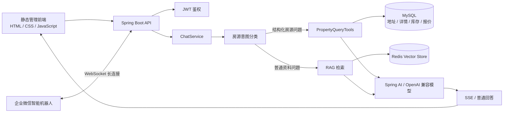

# Londonist 智能房源中心

面向学生公寓销售与运营的智能房源管理系统。系统同时管理公寓地址与详情、房型库存、分档报价和销售推荐规则，并通过 Spring AI Tool Calling 为 AI 提供结构化、可核验的房源查询能力；普通资料类问题继续使用 RAG 知识库回答。

## 当前能力

- 公寓地址管理：支持增删改查、城市/区域筛选、公寓名称模糊搜索。
- 公寓详情管理：维护设施、交通线路、附近学校、附近地标和官网详情。
- 房型库存管理：维护起租日期、最晚退房日期、库存数量和库存状态。
- 分档报价：同一房型可按租期区间配置不同周租价格。
- 批量导入：支持按照结构化 XLSX 模板导入库存和报价。
- 销售推荐：配置“同等条件下优先推荐”的公寓，不覆盖日期、租期、预算、库存和距离等硬条件。
- AI 房源工具：支持房源推荐、公寓详情、报价、名单和库存汇总查询。
- RAG 知识库：支持文档上传、向量化、重新向量化、引用展示和分类检索。
- 流式交互：SSE 返回意图识别、Tool/RAG 处理进度和最终回答。
- 会话记忆：聊天记录保存在 MySQL，较早内容可压缩为摘要。
- 企业微信机器人：通过 WebSocket 长连接接收单聊/群聊文本，并流式返回 RAG 或房源 Tool 回答。
- 中英文界面：默认中文，可切换英文；语言偏好保存在浏览器 `localStorage`。
- 可观测性：提供 Actuator、Prometheus、OpenTelemetry Trace 和 Grafana 本地环境。

## 整体架构



### AI 查询路由

系统将数据分为两类：

1. **结构化业务数据**
   - 公寓地址、附近学校和地标
   - 房型、起租时间、租期、价格、库存
   - 销售推荐优先级
   - 由数据库 Tool 查询，避免依赖向量召回猜测实时房情。

2. **非结构化知识资料**
   - 规章、流程、说明文档及其他知识材料
   - 由 Redis Vector Store 检索，再交给模型生成带引用的回答。

房源意图支持 Java 规则和模型分类两个入口。当前默认关闭 Java 规则，仅由模型处理需要分类的房源问题；分类失败或超时会降级到普通 RAG。

## 核心数据模型

| 表 | 用途 |
|---|---|
| `t_residence` | 公寓名称、城市、区域、地址、车站和地图信息 |
| `t_residence_detail` | 设施、线路、官网链接和详情 Markdown |
| `t_residence_nearby_place` | 公寓附近学校、地标、通勤方式和时间 |
| `t_room_inventory` | 房型、可租日期、库存数量和库存状态 |
| `t_room_price_tier` | 按租期周数划分的周租价格 |
| `t_offer_import_batch` | XLSX 批量导入记录及结果 |
| `t_sales_recommendation` | 同等条件下的销售推荐优先级 |
| `t_category` / `t_document` | 知识库分类和文档元数据 |
| `t_chat_session` / `t_chat_message` | 会话、消息、引用和记忆摘要 |
| `t_wecom_conversation` | 企业微信单聊/群聊与本地聊天会话映射 |
| `t_user` | 后台用户、角色和登录状态 |

库存和价格分开建模：一条 `t_room_inventory` 代表一个可售房型及其日期、库存范围；它可以关联多条 `t_room_price_tier`，例如 12–15 周一个价格、16–25 周一个价格、26 周以上另一个价格。

## AI Tool

`PropertyQueryTools` 当前暴露以下方法：

| Tool | 作用 |
|---|---|
| `search_room_offers` | 按城市、公寓、学校/地标、日期、租期、预算、房型和库存查询推荐 |
| `get_residence_details` | 查询公寓地址、设施、车站、学校和地标 |
| `quote_room_offer` | 根据房源 ID 和日期/周数计算报价 |
| `list_residences` | 查询公寓名单和基础地址信息 |
| `get_inventory_summary` | 汇总城市维度的公寓、房型和库存情况 |

每次模型只会获得当前意图对应的 Tool，减少模型探索式地反复调用多个接口。推荐结果最多返回 4 个公寓、每个公寓最多 2 个选项、最终最多 6 个房型；不足时不会使用距离过远或不满足硬条件的公寓凑数。

## 项目结构

```text
veri-rag/
├── .env.example                         # Docker 部署环境变量模板
├── Dockerfile                           # Java 21 多阶段应用镜像
├── compose.yaml                         # 应用及完整依赖编排
├── nginx/default.conf                   # 应用、SSE 与 Grafana 反向代理
├── observability/prometheus.yml         # Prometheus 抓取与 OTLP 资源配置
├── docs/                                # 可观测性与演示说明
├── outputs/                             # 抓取文档、结构化模板和转换结果
├── scripts/
│   ├── scrape_londonist_residences.py   # Londonist 公寓详情抓取
│   └── observe-rag-demo.sh              # 可观测性演示脚本
├── src/main/java/com/example/verirag/
│   ├── advisor/                         # LLM/RAG 日志与耗时 Advisor
│   ├── common/                          # 统一响应、分页、JWT、文件类型
│   ├── config/                          # Spring AI、Redis、Security 等配置
│   ├── controller/                      # REST API 与 SSE 接口
│   ├── dto/                             # API、导入与 Tool 数据结构
│   ├── entity/                          # MySQL 实体
│   ├── mapper/                          # MyBatis-Plus Mapper
│   ├── memory/                          # 会话记忆与摘要
│   ├── observability/                   # RAG 指标
│   ├── prompt/                          # Prompt 文件加载与动态组装
│   ├── security/                        # JWT 过滤器与用户上下文
│   ├── service/                         # 业务接口
│   ├── service/impl/                    # 业务实现、RAG 入库和问答编排
│   ├── tool/                            # 意图路由、分类和 AI Tool
│   └── util/                            # Excel、HTML、Markdown 解析
├── src/main/resources/
│   ├── mapper/                          # MyBatis XML
│   ├── prompts/                         # RAG、Tool、销售和意图 Prompt
│   ├── sql/                             # 初始化 SQL 和迁移脚本
│   ├── static/
│   │   ├── index.html                   # 单页管理界面
│   │   ├── app.js                       # 页面交互和 API 调用
│   │   ├── i18n.js                      # 中英文翻译与本地语言偏好
│   │   └── styles.css                   # 页面样式
│   ├── application.yaml                 # 应用与 RAG 参数
│   └── schema.sql                       # 房源业务表
└── src/test/                            # Prompt、路由、解析、Tool 和 RAG 测试
```

## 技术栈

- Java 21
- Spring Boot 4.1
- Spring AI 2.0
- Spring Security + JWT
- MyBatis-Plus
- MySQL 8
- Redis + Redis Vector Store
- Apache POI
- OpenTelemetry + Prometheus + Grafana
- 原生 HTML、CSS、JavaScript

## Docker 部署

Compose 会启动 Spring Boot、MySQL 8.4、Redis Stack、Grafana OTEL LGTM 和 Nginx。宿主机只需安装 Docker Engine 与 Docker Compose v2；Java 和 Maven 仅在镜像构建阶段使用。

### 1. 创建环境文件

```bash
cp .env.example .env
```

至少修改以下配置：

```dotenv
DASHSCOPE_API_KEY=你的模型服务密钥
JWT_SECRET=长度足够的随机密钥
MYSQL_PASSWORD=数据库业务用户密码
MYSQL_ROOT_PASSWORD=数据库 root 密码
REDIS_PASSWORD=Redis 密码
```

`.env` 已被 Git 忽略，不要把真实密钥提交到仓库。公网部署时还应设置：

```dotenv
GRAFANA_ROOT_URL=https://your-domain.example/grafana/
```

企业微信机器人在 Docker 部署中默认关闭。需要启用时设置 `WECOM_BOT_ENABLED=true`，并填写 `WECOM_BOT_ID` 和 `WECOM_BOT_SECRET`。

### 2. 构建并启动

```bash
docker compose up -d --build
docker compose ps
```

服务启动顺序为 MySQL/Redis 健康 → 应用健康 → Nginx。首次构建需要下载 Maven 和系统依赖，耗时会比后续启动更长。

默认入口：

| 地址 | 用途 |
|---|---|
| `http://localhost/` | 重定向到管理页面 |
| `http://localhost/veri-rag/` | 管理页面和 API |
| `http://localhost/grafana/` | Grafana，可观测性入口 |
| `http://127.0.0.1:8080/veri-rag/actuator/health` | 应用健康检查 |
| `http://127.0.0.1:3000` | Grafana 本机直连入口 |

MySQL、Redis、应用直连端口和 Grafana 直连端口默认只绑定 `127.0.0.1`；Nginx 的 80 端口默认绑定所有网卡。

### 3. 数据库初始化与持久化

首次创建 `mysql-data` 卷时，MySQL 会执行 `src/main/resources/sql/init.sql`，创建基础用户、知识库和会话表。应用启动后会继续执行幂等的 `schema.sql`，补齐房源、详情、库存、报价和企业微信相关表。

初始化脚本只会在空 MySQL 数据卷上执行。更新 SQL 后，已有环境应使用迁移脚本升级，不能依赖重启容器重复初始化。

以下命名卷保存持久化数据：

- `app-files`：上传文件
- `mysql-data`：业务数据库
- `redis-data`：向量和 Redis 数据
- `observability-data`：Grafana、Prometheus、Tempo 与 Loki 数据

执行 `docker compose down` 不会删除这些卷；执行 `docker compose down -v` 会永久删除全部上述数据，使用前务必确认。

初始化演示账号为 `admin / 123456`。它仅供首次登录，部署后应立即修改，生产环境禁止继续使用默认密码。

### 4. 验证与排障

```bash
docker compose ps
docker compose logs -f app
docker compose logs -f mysql redis observability nginx
curl --fail http://127.0.0.1:8080/veri-rag/actuator/health
```

验证 Redis Search 模块和向量索引：

```bash
docker compose exec redis sh -c 'redis-cli -a "$REDIS_PASSWORD" FT._LIST'
```

Grafana/Prometheus 会从 `app:8080/veri-rag/actuator/prometheus` 抓取指标；应用通过内部地址 `observability:4318` 上报 OTLP Trace 和 Metrics，不需要把 OTLP 或 Prometheus 端口暴露到公网。

### 5. 更新与停止

```bash
git pull
docker compose up -d --build
docker compose logs --tail=200 app
```

停止但保留数据：

```bash
docker compose down
```

生产环境应在 Nginx 前配置 HTTPS，或将 `nginx/default.conf` 扩展为证书终止节点，并限制 MySQL、Redis、Actuator 和 Grafana 的访问来源。

## 宿主机开发运行

只在 Docker 中启动依赖：

```bash
docker compose up -d mysql redis observability
```

然后配置本机应用连接并启动：

```bash
export DASHSCOPE_API_KEY="你的模型服务 API Key"
export JWT_SECRET="本地开发随机密钥"
export MYSQL_URL="jdbc:mysql://localhost:3306/veri_rag?useUnicode=true&characterEncoding=utf8&serverTimezone=Asia/Shanghai&allowPublicKeyRetrieval=true&useSSL=false"
export MYSQL_USERNAME="veri_rag"
export MYSQL_PASSWORD="veri_rag_dev"
export SPRING_DATA_REDIS_HOST="localhost"
export SPRING_DATA_REDIS_PORT="6379"
export SPRING_DATA_REDIS_PASSWORD="veri_rag_dev"
./mvnw spring-boot:run
```

本机开发入口为 `http://localhost:8081/veri-rag/`。

## 常用配置

| 环境变量 | 默认值 | 说明 |
|---|---:|---|
| `DASHSCOPE_API_KEY` | 无 | 模型服务密钥，必填 |
| `LLM_TIMEOUT` | `5m` | 单次模型调用总超时 |
| `LLM_MAX_TOKENS` | `1000` | 单次回答最大输出 Token |
| `RAG_INTENT_CLASSIFIER_ENABLED` | `true` | 是否启用房源意图分类 |
| `RAG_INTENT_JAVA_RULES_ENABLED` | `false` | 是否先使用 Java 确定性规则 |
| `RAG_INTENT_CLASSIFIER_TIMEOUT` | `15s` | 意图分类超时 |
| `RAG_CHUNK_SIZE` | `500` | 文档切片最大 Token 数 |
| `RAG_EMBEDDING_BATCH_SIZE` | `20` | Embedding 单批文本数 |
| `RAG_RETRIEVAL_TOP_K` | `8` | 普通知识问答召回数量 |
| `RAG_SIMILARITY_THRESHOLD` | `0.75` | 最低向量相似度 |
| `RAG_ANSWER_CACHE_ENABLED` | `false` | 是否启用相似问答缓存 |
| `RAG_MEMORY_ENABLED` | `true` | 是否启用会话摘要 |
| `RAG_MEMORY_RECENT_MESSAGES` | `8` | 保留的最近原始消息数 |
| `WECOM_BOT_ENABLED` | Docker 中为 `false` | 是否启动企业微信机器人长连接 |
| `WECOM_BOT_ID` | 无 | 企业微信智能机器人 BotID |
| `WECOM_BOT_SECRET` | 配置文件开发值 | 长连接专用 Secret；生产必须使用环境变量 |
| `WECOM_BOT_DISPLAY_NAME` | `londonist 助手` | 群聊中用于精确移除 `@机器人` 的展示名称 |
| `WECOM_BOT_USER_ID` | `2` | 企业微信会话归属的本地用户 ID |
| `WECOM_BOT_HEARTBEAT_INTERVAL` | `30s` | 长连接心跳间隔 |
| `WECOM_BOT_STREAM_UPDATE_INTERVAL` | `2500ms` | 企业微信流式消息刷新间隔 |

Embedding 服务单次最多接受 20 条文本，因此 `RAG_EMBEDDING_BATCH_SIZE` 不应配置为大于 20。房源、报价和库存查询已经由数据库 Tool 处理，不需要通过提高 RAG `top-k` 解决召回问题。

## 数据导入建议

### 公寓地址与详情

1. 先导入公寓地址 HTML，建立标准公寓名称与 `source_id`。
2. 再导入公寓详情 Markdown，将学校、地标、设施和交通信息关联到已有公寓。
3. 名称存在细微差异时应在导入阶段完成标准化，不要让模型临时猜测名称映射。

### 房型库存与报价

1. 使用 `outputs/residence-offer-template/结构化模板.xlsx`。
2. 库存表保存房型、日期、剩余数量和业务更新时间。
3. 价格表按租期区间保存多个周租档位。
4. 公寓编码优先关联 `t_residence.source_id`。
5. 只有业务更新时间更晚的数据才能覆盖现有记录，避免旧表回滚库存。

## 优化方案

### P0：运行安全与数据可靠性

1. **引入 Flyway 或 Liquibase**
   - 合并 `schema.sql`、`sql/init.sql` 和零散迁移。
   - 禁止应用启动时执行带破坏性的 SQL。
   - 为每个版本提供可追踪、可回滚的迁移记录。

2. **移除源码中的敏感默认值**
   - `jwt.secret`、数据库密码和模型地址全部改为环境变量。
   - 生产环境启动时校验弱密码与缺失密钥。
   - 定期轮换 JWT Secret 和模型 API Key。

3. **统一 Docker 与应用默认配置**
   - 对齐 MySQL 用户、密码、Redis 端口和认证方式。
   - 增加 `.env.example`，降低新环境启动成本。
   - 为 MySQL、Redis、模型服务增加启动前健康检查。

4. **加强导入事务与审计**
   - 每个导入批次使用明确的事务边界。
   - 保存操作者、文件哈希、覆盖数量和失败明细。
   - 支持导入预检、确认后写入和按批次回滚。

### P1：AI 准确率与响应速度

1. **减少重复模型调用**
   - 明确房源问题优先通过轻量意图分类确定单个 Tool。
   - 保持“一次结构化查询返回完整候选”，避免模型逐个公寓查询。
   - 对同一轮内重复 Tool 参数做短期去重。

2. **将距离判断进一步结构化**
   - 当前优先使用数据库中已有通勤描述。
   - 后续可离线计算学校到公寓的步行、骑行、地铁和公交时间并定期更新。
   - 推荐排序保持：步行 > 骑行 > 地铁 > 公交 > 其他。

3. **优化房源推荐排序**
   - 先过滤日期、租期、库存、预算和最大通勤时间等硬条件。
   - 再综合通勤方式、通勤时间、价格、库存紧张程度和销售优先级排序。
   - 返回可解释的排序字段，避免模型自行补充推荐理由。

4. **建立离线评测集**
   - 覆盖 UCL、KCL、IC 等学校查询以及多轮追问。
   - 校验候选公寓、价格档位、总价、售罄状态和最大结果数。
   - 每次修改 Prompt、Tool 或导入逻辑后自动回归。

5. **控制 RAG 上下文质量**
   - Markdown 按公寓完整语义块切片，确保公寓名与附近地点处于同一 Chunk。
   - 对资料问答保留相似度阈值和引用；结构化房情不再依赖 RAG。
   - 记录无结果率、低相似度率和引用点击率，用数据调整参数。

### P1：前端与国际化

1. **完善国际化资源**
   - 当前中英文翻译位于 `static/i18n.js`，语言偏好保存于 `localStorage`。
   - 后续将页面文案改为稳定的翻译 Key，避免依赖中文原文匹配。
   - 将确认弹窗、Toast、接口错误和 AI 回答语言统一纳入语言上下文。

2. **拆分前端模块**
   - 将单体 `app.js` 拆为 API、状态、路由、页面组件和国际化模块。
   - 为搜索、导入、分页和权限状态补充前端测试。
   - 保持专业、简洁的信息密度，避免在表格中堆叠过多操作。

3. **改善长列表体验**
   - 服务端分页、排序和组合筛选参数标准化。
   - 为公寓、房型和导入批次增加可复制筛选链接。
   - 数据量上升后考虑虚拟滚动或独立前端框架。

### P2：可观测性与运维

1. 为意图分类、RAG 检索、Tool 调用和最终生成分别记录耗时与成功率。
2. 所有异步/SSE 线程保持 Trace Context，日志统一包含 `traceId`、`sessionId` 和意图来源。
3. Grafana 增加首包耗时、完整回答耗时、Tool 调用轮数、模型超时率和导入失败率面板。
4. 增加数据库备份、Redis 向量索引重建和上传文件清理策略。
5. 为生产环境配置限流、请求大小限制、审计日志和告警阈值。

## 推荐的下一阶段顺序

1. 使用 Flyway 重建可靠的数据库初始化与迁移流程。
2. 对齐 Docker、应用配置并补充 `.env.example`。
3. 完成房源推荐离线评测集，固定当前正确行为。
4. 将 Tool 输出改为更稳定的结构化推荐结果，并减少模型二次推理。
5. 完成前端翻译 Key 化和浏览器端自动化测试。
6. 再接入地图服务或离线通勤计算，完善地理排序。

## 相关文档

- `docs/observability.md`：可观测性配置说明。
- `docs/observability-demo.md`：本地演示与验证。
- `docs/study-case-environment.md`：学习案例环境说明。
- `outputs/londonist-residences-2026-07-24.md`：Londonist 公寓抓取结果。
